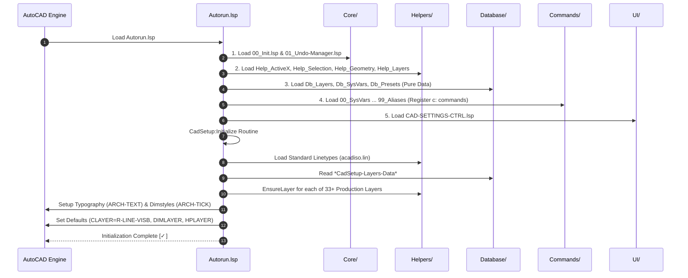

# Cad-Setup-v4: Layered / Horizontal Architecture

A clean, traditional, enterprise-grade architecture for AutoCAD AutoLISP/DCL production drafting systems. Every file has a single technical responsibility, zero duplicate helper code, pure data isolation, and strict unidirectional execution flow.

---

## 1. System Architecture & Layer Hierarchy

The system is organized into **five horizontal layers** that strictly follow a unidirectional dependency model:


---

## 2. Startup & Execution Flow

When AutoCAD loads `Autorun.lsp` (via `APPLOAD` or the Startup Suite), the following sequential lifecycle executes:



---

## 3. Directory Structure & Technical Responsibilities

```
d:\Cad-Setup-v4\
├── Autorun.lsp                 ; Master orchestrator & APPLOAD entry point
├── ARCHITECTURE.md             ; Architectural system diagrams & folder rules
├── DEVELOPER-GUIDE.md          ; Practical recipes & coding conventions
├── Core/
│   ├── 00_Init.lsp             ; Path resolution, logging, environment checks
│   └── 01_Undo-Manager.lsp     ; Re-entrant Undo-mark wrappers (UndoStart / UndoEnd)
├── Database/
│   ├── Db_Layers.lsp           ; Master layer dictionary & properties (colors, lineweights)
│   ├── Db_SysVars.lsp          ; Recommended system variables & drawing states
│   └── Db_Presets.lsp          ; Workspace presets (11 industry drafting profiles)
├── Helpers/
│   ├── Help_ActiveX.lsp        ; Safe COM/VLA wrappers, safe getvar/setvar, clamp
│   ├── Help_Geometry.lsp       ; Bounding boxes in UCS, curve lengths, midpoints, annotative scale
│   ├── Help_Graphics.lsp       ; 2D primitives (DrawBox, DrawLine, AddText), hatch & draw order
│   ├── Help_Layers.lsp         ; EnsureLayer, SetCurrentLayerSafe, LoadLinetype
│   └── Help_Selection.lsp      ; ssget filters, predicates (is-annotation, is-revcloud)
├── Commands/
│   ├── 00_System-Variables.lsp ; Applies sysvars from Database/Db_SysVars.lsp
│   ├── 01_Workflow-Keys.lsp    ; Fast drafting key shortcuts (1, 2, 3, 4)
│   ├── 02_Layers.lsp           ; Layer management commands (RL, DCL, L0, BLL)
│   ├── 03_Blocks.lsp           ; Block creation & transforms (CB, OB, RB, RBH, RBV)
│   ├── 04_Layout-Views.lsp     ; Viewport and presentation tools (LB, A3SERIES)
│   ├── 05_Selection-Filters.lsp; Fast selection isolators (SR, SL, SB, SH, SA, SW)
│   ├── 06_Utilities.lsp        ; Geometry utilities & repair (TC, CIP, BBOX, FL0, PUA, WF)
│   └── 99_Aliases.lsp          ; AutoCAD command alias mapping & quick macros
└── UI/
    ├── CAD-SETTINGS.dcl        ; Pure static DCL dialog interface definition
    └── CAD-SETTINGS-CTRL.lsp   ; Dialog event handlers, preview renderer & presets
```

---

## 4. Architectural Rules & Boundaries ("The Golden Rules")

To maintain high code quality and avoid architectural drift as the project expands, all contributors must adhere to five strict rules:

### Rule 1: Strict Unidirectional Dependency Flow
- Lower levels **must never** call or depend on higher levels.
- `Core/` cannot reference `Helpers/`, `Database/`, `Commands/`, or `UI/`.
- `Helpers/` can only reference `Core/`.
- `Database/` contains pure data and can only reference basic LISP constructs.
- `Commands/` and `UI/` can reference `Core/`, `Helpers/`, and `Database/`.
- `Commands/` files **must never** depend on each other.

### Rule 2: Database Layer Is 100% Pure Data
- Files in `Database/` (`Db_Layers.lsp`, `Db_SysVars.lsp`, `Db_Presets.lsp`) **never execute imperative AutoCAD commands**.
- No `(command ...)`, no `(setvar ...)`, and no DOM manipulation in `Database/`.
- They define associative lists, constants, and pure getter accessors (`CadSetup:GetAllLayers`, `CadSetup:GetRecommendedSysVars`, `CadSetup:GetPresetData`).

### Rule 3: Zero Duplicate Helper Code
- Math functions, bounding box transformations, curve calculations, selection set loops, and layer checks belong in `Helpers/`.
- If two commands need similar geometric logic, the logic must be extracted into `Helpers/Help_Geometry.lsp` or `Helpers/Help_Selection.lsp`.

### Rule 4: Re-Entrant Undo & Error Safety
- Never call raw `(vla-startundomark doc)` or `(vla-endundomark doc)` directly in command files.
- Always use `(CadSetup:UndoStart)` at the beginning of a command and `(CadSetup:UndoEnd)` at the conclusion.
- In every `(defun *error* (msg) ...)`, call `(CadSetup:UndoReset)` to guarantee that an aborted command never leaves an unclosed undo mark in the drawing.

### Rule 5: Pure UI Separation
- `UI/CAD-SETTINGS.dcl` contains **only DCL syntax**. It never writes temporary files at runtime.
- `UI/CAD-SETTINGS-CTRL.lsp` loads the static DCL file, binds event handlers (`action_tile`), renders the image tile, and sets system variables.
