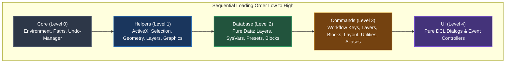
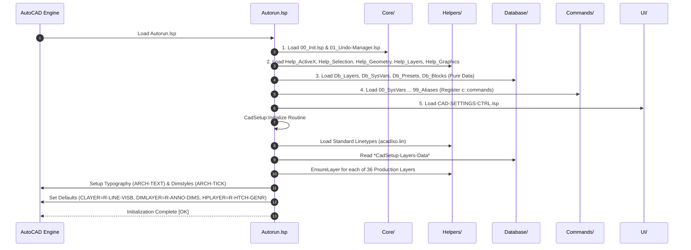
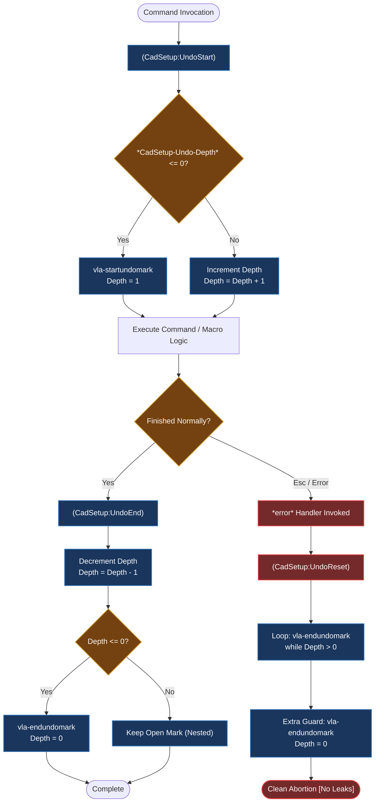
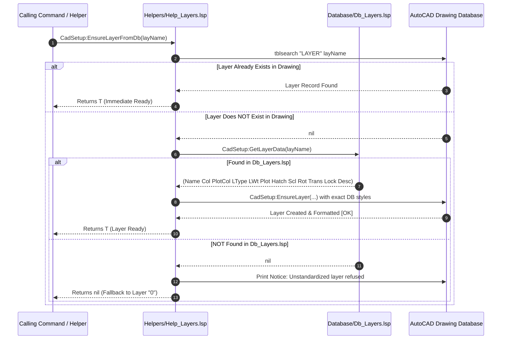

# Cad-Setup-v4: Layered / Horizontal Architecture

A clean, traditional, enterprise-grade architecture for AutoCAD AutoLISP/DCL production drafting systems. Every file has a single technical responsibility, zero duplicate helper code, pure data isolation, strict unidirectional execution flow, and database-enforced layer standardization.

---

## 1. System Architecture & Layer Hierarchy

The system is organized into **five horizontal layers** that strictly follow a unidirectional dependency model:



---

## 2. Startup & Execution Flow

When AutoCAD loads [Autorun.lsp](file:///d:/HASEEB/Cad-Setup-v4/Autorun.lsp) (via `APPLOAD` or the Startup Suite), the following sequential lifecycle executes:



---

## 3. Directory Structure & Technical Responsibilities

```
d:\HASEEB\Cad-Setup-v4\
├── Autorun.lsp                 ; Master orchestrator & APPLOAD entry point
├── ARCHITECTURE.md             ; Architectural system diagrams & folder rules
├── DEVELOPER-GUIDE.md          ; Practical recipes & coding conventions
├── Core/
│   ├── 00_Init.lsp             ; Path resolution, logging, environment checks
│   └── 01_Undo-Manager.lsp     ; Re-entrant Undo-mark wrappers (UndoStart / UndoEnd / UndoReset)
├── Database/
│   ├── Db_Blocks.lsp           ; Master standard joinery block dictionary & procedural geometry data
│   ├── Db_Layers.lsp           ; Master layer dictionary & properties (36 production layers)
│   ├── Db_SysVars.lsp          ; Recommended system variables & drawing states
│   └── Db_Presets.lsp          ; Workspace presets (11 industry drafting profiles)
├── Helpers/
│   ├── Help_ActiveX.lsp        ; Safe COM/VLA wrappers, safe getvar/setvar, clamp
│   ├── Help_Geometry.lsp       ; Bounding boxes in UCS, curve lengths, midpoints, annotative scale
│   ├── Help_Graphics.lsp       ; 2D primitives (DrawBox, DrawLine, AddText), hatch & draw order
│   ├── Help_Layers.lsp         ; EnsureLayerFromDb, EnsureLayer, SetCurrentLayerSafe, LoadLinetype
│   └── Help_Selection.lsp      ; ssget filters, predicates (is-annotation, is-revcloud)
├── Commands/
│   ├── 00_System-Variables.lsp ; Applies sysvars from Database/Db_SysVars.lsp (APPLY-SYSVARS, RSV)
│   ├── 01_Workflow-Keys.lsp    ; Fast drafting key shortcuts (1=HL, 2=VP, 3=GL, 4=LL, 5=ML, 6=AD, 7=HD, 8=BL, `=R-)
│   ├── 02_Layers.lsp           ; Layer management commands (RL, DCL, L0, BLL)
│   ├── 03_Blocks.lsp           ; Block creation, transforms & visual palette (CB, OB, RB, RBH, RBV, BL, 8)
│   ├── 04_Layout-Views.lsp     ; Viewport and presentation tools (TS, A3SERIES, VPCLIPRECTANGLE, VR)
│   ├── 05_Selection-Filters.lsp; Fast selection isolators (SR, SL, SB, SH, SA, SW)
│   ├── 06_Utilities.lsp        ; Geometry utilities & repair (TC, CIP, BBOX, CTRANS, FL0, PUA, WF, WR, LST)
│   └── 99_Aliases.lsp          ; AutoCAD command alias mapping & atomic macros (ROR, SCR, BF, BB, ME, JJ, PC, PO, FF, CC, BR1)
└── UI/
    ├── BLOCK-PALETTE.dcl       ; Visual Standard Joinery Blocks & Components Palette DCL
    ├── CAD-SETTINGS.dcl        ; Pure static DCL dialog interface definition
    ├── CAD-SETTINGS-CTRL.lsp   ; Dialog event handlers, preview renderer & presets
    ├── GRID-GENERATOR.dcl      ; Parametric structural grid dialog
    └── UNIFIED-LAYER-SELECTOR.dcl ; Unified Dynamic Layer Selector (UDLS) & Inspector DCL
```

---

## 4. Architectural Rules & Boundaries ("The Golden Rules")

To maintain high code quality and avoid architectural drift as the project expands, all contributors must adhere to six strict rules:

### Rule 1: Strict Unidirectional Dependency Flow
- Lower levels **must never** call or depend on higher levels.
- `Core/` cannot reference `Helpers/`, `Database/`, `Commands/`, or `UI/`.
- `Helpers/` can only reference `Core/` and pure data from `Database/`.
- `Database/` contains pure data and can only reference basic LISP constructs.
- `Commands/` and `UI/` can reference `Core/`, `Helpers/`, and `Database/`.
- `Commands/` files **must never** depend on each other.

### Rule 2: Database Layer Is 100% Pure Data
- Files in `Database/` (`Db_Layers.lsp`, `Db_SysVars.lsp`, `Db_Presets.lsp`, `Db_Blocks.lsp`) **never execute imperative AutoCAD commands**.
- No `(command ...)`, no `(setvar ...)`, and no DOM manipulation in `Database/`.
- They define associative lists, constants, and pure getter accessors (`CadSetup:GetAllLayers`, `CadSetup:GetLayerData`, `CadSetup:GetRecommendedSysVars`, `CadSetup:GetPresetData`).

### Rule 3: Zero Duplicate Helper Code
- Math functions, bounding box transformations, curve calculations, selection set loops, and layer checks belong in `Helpers/`.
- If two commands need similar geometric logic, the logic must be extracted into `Helpers/Help_Geometry.lsp` or `Helpers/Help_Selection.lsp`.

### Rule 4: Re-Entrant Undo & Error Safety
- Never call raw `(vla-startundomark doc)` or `(vla-endundomark doc)` directly in command files.
- Always wrap command suites in atomic `(CadSetup:UndoStart)` and `(CadSetup:UndoEnd)` transactions.
- In every `(defun *error* (msg) ...)`, invoke `(CadSetup:UndoReset)` to guarantee that an aborted command never leaves an unclosed undo mark or a corrupt depth counter in the drawing.
- **Interactive Commands**: Any command executing native AutoCAD commands that wait for user clicks (e.g., `_.PLINE`, `_.ROTATE pause _R`, `_.RECTANG`) must use an interactive command pause loop `(while (> (getvar 'cmdactive) 0) (command pause))` so that `(CadSetup:UndoEnd)` executes only after the user concludes input.
- **Undo Exception Policy**: Read-only queries (e.g., `TC` - Total Length) and database maintenance tools (e.g., `PUA` / `QA` - Purge & Audit) must **not** be wrapped in undo blocks.

### Rule 5: Pure UI Separation
- `UI/*.dcl` files contain **only DCL syntax**. They never write temporary files at runtime.
- Controllers in `UI/` load static DCL files, bind event handlers (`action_tile`), render image tiles, and apply configurations.

### Rule 6: Strict Database Layer Loading & Zero Blind Layer Creation
- **Never blindly create layers**: Do not call raw `(vla-add (vla-get-layers doc) ...)` or `(command "._-layer" "_m" ...)` on the fly with unstandardized or default attributes.
- **Never hardcode layer specifications**: Colors, linetypes, lineweights, and hatch patterns must never be hardcoded in command or helper files.
- **Always load through `CadSetup:EnsureLayerFromDb`**: Any function requiring a layer must call `(CadSetup:EnsureLayerFromDb layName)`. This verifies whether the layer exists, looks up its standardized definition in `Database/Db_Layers.lsp`, and creates it with complete production-grade attributes.
- **Strict Fallback Policy**: If an unregistered layer is requested that does not exist in `Database/Db_Layers.lsp`, the system refuses unstandardized creation, displays a warning notice in the AutoCAD console, and safely falls back to layer `"0"`.

---

## 5. Architectural Subsystems & Visual Flows

### Subsystem A: Re-Entrant Undo Transaction Manager
The re-entrant undo manager ([Core/01_Undo-Manager.lsp](file:///d:/HASEEB/Cad-Setup-v4/Core/01_Undo-Manager.lsp)) prevents orphaned undo marks when commands call sub-commands or when users abort via `Esc`:



---

### Subsystem B: Authoritative Database Layer Resolution
All layer requests across commands and graphic primitives resolve through `CadSetup:EnsureLayerFromDb`:


